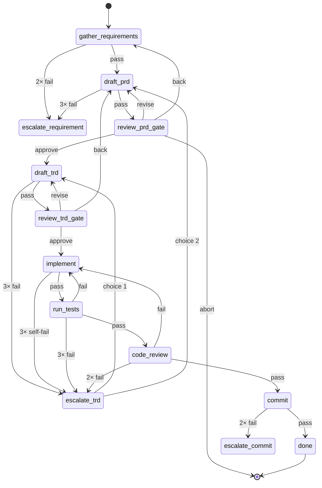

# Self-check: trace through a bad-path run of `prd-to-ship`

目的：用一个虚构但典型的"出问题"场景，手动 trace 一遍状态机，确认：
- 状态转移闭环、没有死循环
- 计数器路径正确
- escape hatch 触发时机合理
- 回退能真正回到"该回去"的上游节点

## 场景

> 用户：`/workflow run prd-to-ship "我想给后台加批量导出 CSV 的功能"`
>
> 第一次 review PRD 时反馈"要支持按时间过滤"。  
> TRD 写出来后 implement 出代码、跑测试挂了 1 次（漏处理空 list）→ 修好。  
> 进 review，reviewer-test-honesty 抓到 1 个弱断言（blocker），打回。  
> implement 修了断言，再跑 review，过了。  
> 提交，完成。

## 全程 state 转移表

| # | current_state | action | next_state | edge_counter 变化 | history append |
|---|---|---|---|---|---|
| 1 | `gather_requirements` | skill 跑 prd-clarify，pass | `draft_prd` | – | pass attempt=1 |
| 2 | `draft_prd` | skill 跑 prd-author，pass | `review_prd_gate` | – | pass attempt=1 |
| 3 | `review_prd_gate` | user: `revise 要支持按时间过滤` | `draft_prd` | – | result=revise，写 PRD_feedback.md |
| 4 | `draft_prd` | skill 跑 prd-author（这次读了 feedback），pass | `review_prd_gate` | – | pass attempt=2 |
| 5 | `review_prd_gate` | user: `approve` | `draft_trd` | – | result=approve |
| 6 | `draft_trd` | skill 跑 trd-author，pass | `review_trd_gate` | – | pass attempt=1 |
| 7 | `review_trd_gate` | user: `approve` | `implement` | – | result=approve |
| 8 | `implement` | skill 跑 implement，pass | `run_tests` | – | pass attempt=1 |
| 9 | `run_tests` | skill 跑 test-runner，**fail**（空 list panic）| `implement` | `run_tests->implement`=1 | fail attempt=1 |
| 10 | `implement` | skill 跑 implement（读 test_failures.md），pass | `run_tests` | – | pass attempt=2 |
| 11 | `run_tests` | pass | `code_review` | – | pass attempt=2 |
| 12 | `code_review` | parallel × 3 reviewer + aggregator，**fail**（test-honesty 抓到弱断言）| `implement` | `code_review->implement`=1 | fail attempt=1 |
| 13 | `implement` | skill 跑 implement（读 review_verdict.md），pass | `run_tests` | – | pass attempt=3 |
| 14 | `run_tests` | pass | `code_review` | – | pass attempt=3 |
| 15 | `code_review` | pass | `commit` | – | pass attempt=2 |
| 16 | `commit` | skill 跑 committer，pass | `done` | – | pass attempt=1 |
| 17 | `done` | terminal，写 SUMMARY.md | – | – | – |

每一步都有出口、都有 history、计数器分别记录在不同的边上。✓

## 极端场景 1：测试一直挂

假设 step 9 之后，implement 修了仍挂，再修又挂。

| # | current | action | next | edge_counter | 备注 |
|---|---|---|---|---|---|
| ... | `run_tests` | fail | `implement` | `run_tests->implement`=1 | 第 1 次 |
| ... | `implement` | pass | `run_tests` | – | |
| ... | `run_tests` | fail | `implement` | `run_tests->implement`=2 | 第 2 次 |
| ... | `implement` | pass | `run_tests` | – | |
| ... | `run_tests` | fail（第 3 次）| ⚠️ counter→3，触发 on_exceed | `run_tests->implement`=3 | **走 `escalate_trd`** |
| ... | `escalate_trd` | human，列出诊断 | 用户选 1 = `draft_trd` | – | 回 TRD 重新设计 |

✓ 三次失败后自动升级到"TRD 可能有问题"，回 TRD 重新设计——和用户描述的"卡点后退到 TRD"完全一致。

**关键定义（已统一）：** `max_attempts: N` = "这条 fail 边最多走 N 次"。第 N 次失败时 counter bump 到 N，`counter ≥ max_attempts` 命中，**立即**转 `on_exceed`，不再回 on_fail。所以 max_attempts=3 时，第 3 次 fail 就触发 exceed（而不是"第 N+1 次"）。

> 这里 meta-agent / spec / architecture 三处都已对齐 `≥`。verify.sh §5 把这个一致性卡住。

## 极端场景 2：review 反复识破"糊弄"

| # | current | action | next | counter | 备注 |
|---|---|---|---|---|---|
| ... | `code_review` | fail（test-honesty 抓到弱断言）| `implement` | `code_review->implement`=1 | |
| ... | `implement` | "修复"——但只是改了一处弱断言 | `run_tests` | – | |
| ... | `run_tests` | pass（其实测试还是没在测）| `code_review` | – | |
| ... | `code_review` | fail（test-honesty 抓到**另一处**弱断言）| `implement` | `code_review->implement`=2 | |
| ... | `implement` | 再"修"一次 | `run_tests` | – | |
| ... | `run_tests` | pass | `code_review` | – | |
| ... | `code_review` | fail（继续抓到）| ⚠️ counter→3，但 max_attempts=2 | `code_review->implement`=3 | **走 `escalate_trd`** |

✓ Review 反复识破糊弄，2 次后强制升级。`code_review` 的 `max_attempts=2`（比测试更严，因为糊弄迹象比单纯测试挂更可疑）。

## 极端场景 3：用户 PRD 反复改不出来

| # | current | action | next |
|---|---|---|---|
| ... | `review_prd_gate` | revise | `draft_prd` |
| ... | `draft_prd` | pass | `review_prd_gate` |
| ... | `review_prd_gate` | revise（第 2 次）| `draft_prd` |
| ... | `draft_prd` | pass | `review_prd_gate` |
| ... | `review_prd_gate` | revise（第 N 次）| ... |

⚠️ **Gate 节点没有计数器。** Gate 的回退可能无限循环（用户一直 revise）。

**这是设计选择**：gate 由人主导，人想 revise 多少次都行。但如果人和 model 进入"我说改/它改不到我要的"的死结，没有自动 escape。

**缓解：**
- 在 meta-agent prompt 里加一条：gate 反复 revise 同一个 state 超过 5 次时，主动询问用户"要不要切到 escalate_requirement"。这不是硬约束，是温和提示。

修改 meta-agent.md 加上这条。

## 极端场景 4：手动接管 + resume

| # | current | action | next |
|---|---|---|---|
| ... | `escalate_trd` | 用户选 "3) 手动改，你 resume" | `_resume_after_manual` |
| ... | `_resume_after_manual` | orchestrator 持久化、等用户输 `resume` | （暂停）|
| ... | （用户编辑 artifacts/TRD.md，输 `resume`）| | 回到**触发 escalate 之前**的 state？还是 escalate 路由里指定的 state？ |

⚠️ 这里语义需要明确。我在 spec/workflow.md 写的是"`_resume_after_manual` 的下一站由 escalate state 的 route value 决定"——但 `_resume_after_manual` 本身没有 routes（它在 routes 里是 value，不是 key）。

**正解（已修订）：** `_resume_after_manual` 是一个伪 state。当 escalate state 的 route 指向它时，orchestrator 应记录"用户手动接管中，从 `<触发 escalate 时的 state>` 重做"，然后等 `resume` 命令。具体到 prd-to-ship 的 escalate_trd：用户选 3 → state.json 里写 `pending_manual_resume_at: implement`（或 `code_review`，取决于哪个边超阈值）→ 等 `resume` → 回到那个 state 跑一次。

**在 meta-agent.md 里要加这块逻辑。** （下面会改）

## 修订项汇总

1. `max_attempts` 语义：counter ≥ max_attempts 即触发 on_exceed（不是 >）。
2. Gate 防死循环温和提示：同一 gate 累计 revise/back ≥ 5 次时主动询问是否升级。
3. `_resume_after_manual` 实现：state.json 加 `pending_manual_resume_at` 字段，记触发 escalate 的那个 state，resume 后跳回那里重跑。

修订都要回写到 `orchestrator/meta-agent.md` 和 `spec/workflow.md`。

## 状态图

每个状态都有"向下"路径和"向上 / 升级"出口。✓
